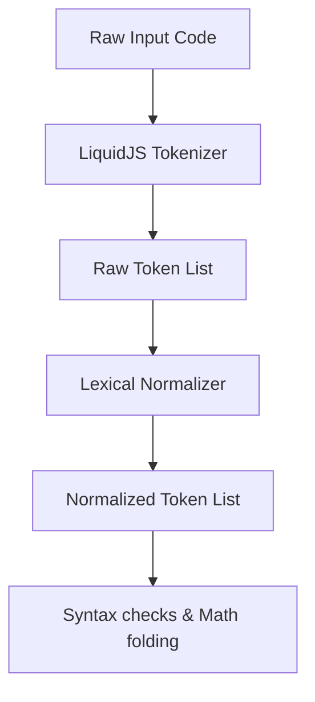

# Proposal: Parser & Lexical Validation Refactoring Plan

This proposal outlines a plan to refactor the parser, tokenizer, and lexical validation layers in the custom `liquidjs` fork to make them more robust, eliminate regex-based heuristics, and establish reliable syntax diagnostics.

---

## 1. Objectives
- **Zero Regex Dependency**: Replace remaining regex checks in syntax diagnostics and formatting with token-based analysis.
- **Robust Error Recovery**: Prevent the parser from crashing on syntax errors, ensuring it collects diagnostics and proceeds.
- **Accurate Property Path Resolution**: Use the standard LiquidJS Tokenizer to differentiate between simple property chains (e.g. `obj.prop`) and complex logical/relational expressions (e.g., `a and b.c`).
- **Standardized AST Ranges**: Ensure every AST tag instance records its precise character start/end offsets for accurate Code Action targeting.

---

## 2. Phase 1: Standardized Tokenization & Normalization
Currently, standard LiquidJS tokenization is too restrictive to analyze computational math and increments/decrements. We propose introducing a formal **Lexical Normalization Phase** that runs immediately after raw tokenization:

### Normalization Rules
1. **Decrement Splitting (`a--`)**:
   - Detect value tokens ending in `--` and split them into `Value(a)`, `Other(-)`, `Other(-)`.
2. **Unary/Binary Operator Separation (`a | +2` or `a -2`)**:
   - Check if a value token starts with `+` or `-` and is preceded by another value or pipe token.
   - If true, split the sign into a separate `Other` operator token, leaving the remainder as the operand token.

---

## 3. Phase 2: Resilient Parsing & Error Recovery
To prevent the language server from failing on syntax errors:

1. **Tag Isolation**:
   - Parse each tag block in isolation using a custom parser wrapper rather than running a global compiler parse on the entire file.
2. **Diagnostics Collection**:
   - Catch parser exceptions per tag, extract the error location range, and translate the error message into a structured LSP Diagnostic.
3. **Resilient AST Tree**:
   - Return a partial AST containing successfully parsed tags and placeholder nodes for failed tags, allowing formatting and downstream type-checking to continue functioning.

---

## 4. Phase 3: Token-Based Property Path Validation
Resolve bugs where complex expressions are misidentified as simple property paths:

1. **Avoid String Splitting**:
   - Replace manual `expr.split('.')` checks with a tokenizer-driven path scanner.
2. **Tokenizer Verification**:
   - Run the LiquidJS `Tokenizer` over the path segment.
   - If `tokenizer.readValue()` parses the entire string as a single `PropertyAccessToken`, treat it as a valid property chain.
   - If it contains logical keywords (`and`, `or`), operators, or multiple tokens, let it fall through to standard expression linting.

---

## 5. Phase 4: AST Character Offsets & Ranges
For accurate Quick Fixes, we must map AST nodes directly back to the source text document:

1. **Metadata Injection**:
   - Extend custom tag classes (`parseAssign`, `assignVar`, etc.) to include `begin` and `end` byte index properties inherited from their corresponding tokens.
2. **Range Calculations**:
   - Use these indexes to compute exact 0-indexed line/character ranges for diagnostics, avoiding imprecise string matching.
